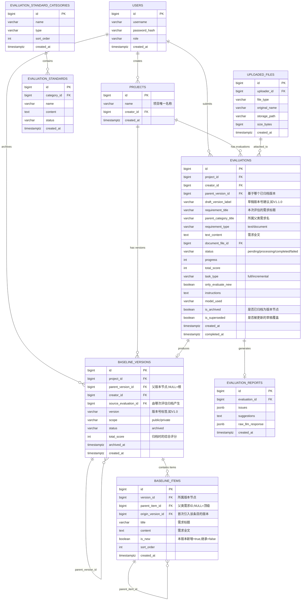

# 需求可测试性评估系统 — 数据库设计建议

> **数据库**: PostgreSQL 16+ (推荐) / MySQL 8.0+  
> **字符集**: UTF-8  
> **时间字段**: UTC 时区，`TIMESTAMPTZ` 类型

---

## 核心设计思路：三层模型

```
┌─────────────────────────────────────────────────────┐
│  Layer 3: 评估层 (evaluations)                       │
│  "正在做的工作" — 含 AI 评估报告、草稿标记             │
│           ↓ 归档（archive）                          │
├─────────────────────────────────────────────────────┤
│  Layer 2: 版本节点层 (baseline_versions)             │
│  "提交点" — 版本树的每个节点，记录版本间父子关系        │
│           ↓ 快照展开                                 │
├─────────────────────────────────────────────────────┤
│  Layer 1: 快照条目层 (baseline_items)                │
│  "版本内容" — 该版本下所有需求条目的完整快照            │
└─────────────────────────────────────────────────────┘
```

> **核心规则**：每次归档 = 从父版本继承所有条目 + 添加/修改本次新条目，形成新版本的完整快照。  
> 草稿（未归档的评估记录）可被同条件的新评估**覆盖**，归档后即固化为永久版本节点。

---

## 版本树示意（对应用户例子）

```
项目1
│
├── V1.0 ──────────────────────────── [归档] Op1
│   内容: [父类需求1]
│
├─┬─ V1.1 (parent=V1.0) ──────────── [归档] Op2
│ │  内容: [父类需求1, 子类需求1(新)]
│ │
│ └─ V1.1.0 (parent=V1.0) ────────── [归档] Op5 (Op3被Op4草稿覆盖)
│    内容: [父类需求1, 子类需求3(新)]
│    │
│    └── V1.2 (parent=V1.1.0) ────── [归档] Op6
│        内容: [父类需求1, 子类需求3(继承), 子类需求4(新)]
│
└── (V1.1 与 V1.1.0 并列，共同挂在 V1.0 之下)
```

---

## ER 关系图



---

## 表结构详细说明

### `users` — 用户表

```sql
CREATE TABLE users (
    id              BIGSERIAL PRIMARY KEY,
    username        VARCHAR(64)  NOT NULL UNIQUE,
    password_hash   VARCHAR(255) NOT NULL,
    role            VARCHAR(20)  NOT NULL DEFAULT 'user' CHECK (role IN ('admin', 'user')),
    created_at      TIMESTAMPTZ  NOT NULL DEFAULT NOW()
);
```

---

### `projects` — 项目注册表

> 一个项目名对应一棵独立的版本树。

```sql
CREATE TABLE projects (
    id          BIGSERIAL PRIMARY KEY,
    name        VARCHAR(255) NOT NULL UNIQUE,   -- 项目唯一名称
    creator_id  BIGINT       NOT NULL REFERENCES users(id),
    created_at  TIMESTAMPTZ  NOT NULL DEFAULT NOW()
);

CREATE INDEX idx_projects_name ON projects(name);
```

---

### `baseline_versions` — 版本节点表（版本树）

> **每一行 = 版本树上的一个节点（一次归档提交）**。  
> 通过 `parent_version_id` 构成树状结构，支持分叉（多个子版本并列挂在同一父节点下）。

```sql
CREATE TABLE baseline_versions (
    id                   BIGSERIAL PRIMARY KEY,
    project_id           BIGINT       NOT NULL REFERENCES projects(id),
    parent_version_id    BIGINT       REFERENCES baseline_versions(id) ON DELETE RESTRICT,
                                      -- NULL = 根版本（V1.0）；非 NULL = 有父版本
    creator_id           BIGINT       NOT NULL REFERENCES users(id),
    source_evaluation_id BIGINT       REFERENCES evaluations(id) ON DELETE SET NULL,
                                      -- 由哪次评估归档产生（溯源用）
    version              VARCHAR(20)  NOT NULL,
    scope                VARCHAR(20)  NOT NULL DEFAULT 'private' CHECK (scope IN ('public', 'private')),
    total_score          INT          CHECK (total_score BETWEEN 0 AND 100),
    desc                 TEXT,
    archived_at          TIMESTAMPTZ  NOT NULL DEFAULT NOW(),
    created_at           TIMESTAMPTZ  NOT NULL DEFAULT NOW(),

    -- 同一项目下，版本标签唯一
    UNIQUE (project_id, version)
);

CREATE INDEX idx_bv_project      ON baseline_versions(project_id);
CREATE INDEX idx_bv_parent       ON baseline_versions(parent_version_id);
CREATE INDEX idx_bv_project_ver  ON baseline_versions(project_id, version);
```

---

### `baseline_items` — 快照条目表

> **每一行 = 某个版本节点下的一条需求条目**。  
> 每次归档时：从父版本**复制**所有条目（`is_new=FALSE`）+ 写入本次新增条目（`is_new=TRUE`）。  
> 查询任意版本的完整需求只需 `WHERE version_id = ?`，无需递归。

```sql
CREATE TABLE baseline_items (
    id                BIGSERIAL PRIMARY KEY,
    version_id        BIGINT       NOT NULL REFERENCES baseline_versions(id) ON DELETE CASCADE,
    parent_item_id    BIGINT       REFERENCES baseline_items(id) ON DELETE SET NULL,
                                   -- NULL = 顶级需求（父类需求）；非 NULL = 子类需求
    origin_version_id BIGINT       REFERENCES baseline_versions(id) ON DELETE SET NULL,
                                   -- 该条目最早在哪个版本首次引入（用于显示"新增于V1.1"）
    title             VARCHAR(512) NOT NULL,   -- 需求标题
    content           TEXT,                    -- 需求全文
    is_new            BOOLEAN      NOT NULL DEFAULT TRUE,
                                   -- TRUE=本版本新增；FALSE=从父版本继承
    sort_order        INT          NOT NULL DEFAULT 0,
    created_at        TIMESTAMPTZ  NOT NULL DEFAULT NOW()
);

CREATE INDEX idx_bi_version     ON baseline_items(version_id);
CREATE INDEX idx_bi_parent_item ON baseline_items(parent_item_id);
CREATE INDEX idx_bi_version_new ON baseline_items(version_id, is_new);
```

---

### `evaluations` — 评估任务表（含草稿机制）

> **每一行 = 一次 AI 评估工作记录**，可能是草稿（待归档）或已归档。  
> **草稿覆盖规则**：当同一 `(project_id, parent_version_id, draft_version_label, creator_id)`  
> 组合已存在未归档记录时，将旧记录标记 `is_superseded=TRUE`，新记录成为当前草稿。

```sql
CREATE TABLE evaluations (
    id                   BIGSERIAL PRIMARY KEY,
    project_id           BIGINT       NOT NULL REFERENCES projects(id),
    creator_id           BIGINT       NOT NULL REFERENCES users(id),
    parent_version_id    BIGINT       REFERENCES baseline_versions(id) ON DELETE SET NULL,
                                      -- 本次评估基于哪个已归档版本（NULL=全新项目）
    draft_version_label  VARCHAR(20),  -- 建议的版本号，如"V1.1.0"（草稿阶段可被覆盖）
    requirement_title    VARCHAR(512) NOT NULL,
    parent_category_title VARCHAR(512), -- 所属父类需求名（归档时用于定位 parent_item_id）
    requirement_type     VARCHAR(20)  NOT NULL CHECK (requirement_type IN ('text', 'document')),
    text_content         TEXT,
    document_file_id     BIGINT       REFERENCES uploaded_files(id) ON DELETE SET NULL,
    status               VARCHAR(20)  NOT NULL DEFAULT 'pending'
                                      CHECK (status IN ('pending', 'processing', 'completed', 'failed')),
    progress             INT          NOT NULL DEFAULT 0 CHECK (progress BETWEEN 0 AND 100),
    total_score          INT          CHECK (total_score BETWEEN 0 AND 100),
    task_type            VARCHAR(20)  NOT NULL CHECK (task_type IN ('full', 'incremental')),
    only_evaluate_new    BOOLEAN      NOT NULL DEFAULT FALSE,
    instructions         TEXT,
    model_used           VARCHAR(128),
    is_archived          BOOLEAN      NOT NULL DEFAULT FALSE,  -- 已归档为版本节点
    is_superseded        BOOLEAN      NOT NULL DEFAULT FALSE,  -- 已被更新草稿覆盖
    created_at           TIMESTAMPTZ  NOT NULL DEFAULT NOW(),
    completed_at         TIMESTAMPTZ
);

CREATE INDEX idx_ev_project        ON evaluations(project_id);
CREATE INDEX idx_ev_creator        ON evaluations(creator_id);
CREATE INDEX idx_ev_parent_version ON evaluations(parent_version_id);
CREATE INDEX idx_ev_draft_label    ON evaluations(project_id, parent_version_id, draft_version_label);
CREATE INDEX idx_ev_status         ON evaluations(status);
```

---

### `evaluation_reports` — 评估报告详情表

```sql
CREATE TABLE evaluation_reports (
    id               BIGSERIAL PRIMARY KEY,
    evaluation_id    BIGINT NOT NULL UNIQUE REFERENCES evaluations(id) ON DELETE CASCADE,
    issues           JSONB  NOT NULL DEFAULT '[]',
    suggestions      TEXT   NOT NULL DEFAULT '',
    raw_llm_response JSONB,
    created_at       TIMESTAMPTZ NOT NULL DEFAULT NOW()
);
```

---

### `evaluation_standard_categories` — 评估标准分类表

```sql
CREATE TABLE evaluation_standard_categories (
    id          BIGSERIAL PRIMARY KEY,
    name        VARCHAR(128) NOT NULL,
    type        VARCHAR(20)  NOT NULL DEFAULT 'default' CHECK (type IN ('default', 'user')),
    sort_order  INT          NOT NULL DEFAULT 0,
    created_at  TIMESTAMPTZ  NOT NULL DEFAULT NOW()
);
```

---

### `evaluation_standards` — 评估标准文件表

```sql
CREATE TABLE evaluation_standards (
    id           BIGSERIAL PRIMARY KEY,
    category_id  BIGINT       NOT NULL REFERENCES evaluation_standard_categories(id) ON DELETE CASCADE,
    name         VARCHAR(255) NOT NULL,
    content      TEXT,
    storage_path VARCHAR(512),
    status       VARCHAR(20)  NOT NULL DEFAULT 'enabled' CHECK (status IN ('enabled', 'disabled')),
    updated_at   TIMESTAMPTZ  NOT NULL DEFAULT NOW(),
    created_at   TIMESTAMPTZ  NOT NULL DEFAULT NOW()
);
```

---

### `uploaded_files` — 上传文件表

```sql
CREATE TABLE uploaded_files (
    id            BIGSERIAL PRIMARY KEY,
    uploader_id   BIGINT        NOT NULL REFERENCES users(id),
    file_type     VARCHAR(20)   NOT NULL CHECK (file_type IN ('requirement', 'standard')),
    original_name VARCHAR(512)  NOT NULL,
    storage_path  VARCHAR(1024) NOT NULL,
    size_bytes    BIGINT        NOT NULL,
    created_at    TIMESTAMPTZ   NOT NULL DEFAULT NOW()
);
```

---

## 关键业务逻辑：6次操作的数据变化追踪

### 操作1：全新评估，归档 → V1.0

```
不引用任何基准，父类需求1，归档
```

```sql
-- Step 1: 确保项目存在
INSERT INTO projects (name, creator_id) VALUES ('项目名1', :uid)
  ON CONFLICT (name) DO NOTHING;

-- Step 2: 创建评估（全量评估，无父版本）
INSERT INTO evaluations (project_id, parent_version_id, draft_version_label,
    requirement_title, task_type, text_content, ...)
VALUES (:pid, NULL, 'V1.0', '父类需求1', 'full', '...', ...);

-- Step 3: AI 评估完成，归档
-- 3a. 创建版本节点
INSERT INTO baseline_versions (project_id, parent_version_id, source_evaluation_id, version, ...)
VALUES (:pid, NULL, :eval_id, 'V1.0', ...);
-- 返回 version_id = 100

-- 3b. 写入快照条目（父类需求1作为顶级，is_new=TRUE）
INSERT INTO baseline_items (version_id, parent_item_id, origin_version_id, title, is_new)
VALUES (100, NULL, 100, '父类需求1', TRUE);
-- 返回 item_id = 1001

-- 3c. 更新评估记录标记已归档
UPDATE evaluations SET is_archived = TRUE WHERE id = :eval_id;
```

**此时 baseline_items 快照（version 100/V1.0）：**

| item_id | parent_item_id | title    | is_new | origin_version |
|:-------:|:--------------:|:--------:|:------:|:--------------:|
| 1001    | NULL           | 父类需求1 | TRUE   | V1.0           |

---

### 操作2：引用V1.0，归档 → V1.1（子类需求1新增）

```sql
-- 创建版本节点（parent = V1.0）
INSERT INTO baseline_versions (project_id, parent_version_id, version, ...)
VALUES (:pid, 100, 'V1.1', ...);
-- 返回 version_id = 101

-- 从父版本 V1.0 复制所有条目（is_new=FALSE）
INSERT INTO baseline_items (version_id, parent_item_id, origin_version_id, title, is_new)
SELECT 101, parent_item_id, origin_version_id, title, FALSE
FROM baseline_items WHERE version_id = 100;
-- 复制了 item_id=1001（父类需求1）到 item_id=2001

-- 写入新增条目：子类需求1，挂在父类需求1之下
INSERT INTO baseline_items (version_id, parent_item_id, origin_version_id, title, is_new)
VALUES (101, 2001, 101, '子类需求1', TRUE);
```

**此时 baseline_items 快照（version 101/V1.1）：**

| item_id | parent_item_id | title    | is_new | origin_version |
|:-------:|:--------------:|:--------:|:------:|:--------------:|
| 2001    | NULL           | 父类需求1 | FALSE  | V1.0           |
| 2002    | 2001           | 子类需求1 | TRUE   | V1.1           |

---

### 操作3：引用V1.0，**不归档** → 草稿"V1.1.0"（子类需求2）

```sql
INSERT INTO evaluations (project_id, parent_version_id, draft_version_label,
    requirement_title, parent_category_title, is_archived, ...)
VALUES (:pid, 100, 'V1.1.0', '子类需求2', '父类需求1', FALSE, ...);
-- 返回 eval_id = 300（草稿，暂不归档）
```

---

### 操作4：引用V1.0，**不归档**，**覆盖**操作3的草稿"V1.1.0"（子类需求3）

```sql
-- 将操作3的草稿标记为"已被覆盖"
UPDATE evaluations
SET is_superseded = TRUE
WHERE project_id = :pid
  AND parent_version_id = 100
  AND draft_version_label = 'V1.1.0'
  AND is_archived = FALSE
  AND is_superseded = FALSE;

-- 创建新草稿（内容为子类需求3）
INSERT INTO evaluations (project_id, parent_version_id, draft_version_label,
    requirement_title, parent_category_title, is_archived, ...)
VALUES (:pid, 100, 'V1.1.0', '子类需求3', '父类需求1', FALSE, ...);
-- 返回 eval_id = 301（当前有效草稿）
```

---

### 操作5：归档操作4的草稿 → V1.1.0（与V1.1并列挂在V1.0下）

```sql
-- 创建版本节点（parent = V1.0，与V1.1同级！）
INSERT INTO baseline_versions (project_id, parent_version_id, source_evaluation_id, version, ...)
VALUES (:pid, 100, 301, 'V1.1.0', ...);
-- 返回 version_id = 102

-- 从父版本 V1.0 复制所有条目（is_new=FALSE）
INSERT INTO baseline_items (version_id, parent_item_id, origin_version_id, title, is_new)
SELECT 102, parent_item_id, origin_version_id, title, FALSE
FROM baseline_items WHERE version_id = 100;
-- 复制了父类需求1 → item_id = 3001

-- 写入新增条目：子类需求3
INSERT INTO baseline_items (version_id, parent_item_id, origin_version_id, title, is_new)
VALUES (102, 3001, 102, '子类需求3', TRUE);
```

**此时 baseline_versions（项目1的版本树）：**

| id  | parent_version_id | version |
|:---:|:-----------------:|:-------:|
| 100 | NULL              | V1.0    |
| 101 | 100               | V1.1    |
| 102 | 100               | V1.1.0  |

**V1.1 和 V1.1.0 均挂在 V1.0 之下，并列存在，互不影响。**

---

### 操作6：引用V1.1.0，归档 → V1.2（子类需求3继承+子类需求4新增）

```sql
-- 创建版本节点（parent = V1.1.0）
INSERT INTO baseline_versions (project_id, parent_version_id, version, ...)
VALUES (:pid, 102, 'V1.2', ...);
-- 返回 version_id = 103

-- 从父版本 V1.1.0 复制所有条目（包括父类需求1、子类需求3，全部 is_new=FALSE）
INSERT INTO baseline_items (version_id, parent_item_id, origin_version_id, title, is_new)
SELECT 103, parent_item_id, origin_version_id, title, FALSE
FROM baseline_items WHERE version_id = 102;
-- 复制了 父类需求1(4001) 和 子类需求3(4002)

-- 写入新增条目：子类需求4
INSERT INTO baseline_items (version_id, parent_item_id, origin_version_id, title, is_new)
VALUES (103, 4001, 103, '子类需求4', TRUE);
```

**最终版本树与快照内容：**

```
项目1
├── V1.0     → [父类需求1]
├── V1.1     → [父类需求1, 子类需求1]
├── V1.1.0   → [父类需求1, 子类需求3]
└── V1.2     → [父类需求1, 子类需求3, 子类需求4]  (V1.1.0的子版本)
```

---

## 常用查询

### 获取某项目的完整版本树

```sql
WITH RECURSIVE version_tree AS (
    -- 根节点
    SELECT id, parent_version_id, version, 0 AS depth, version::TEXT AS path
    FROM baseline_versions
    WHERE project_id = :pid AND parent_version_id IS NULL

    UNION ALL

    SELECT bv.id, bv.parent_version_id, bv.version, vt.depth + 1,
           vt.path || ' → ' || bv.version
    FROM baseline_versions bv
    JOIN version_tree vt ON bv.parent_version_id = vt.id
)
SELECT * FROM version_tree ORDER BY depth, version;
```

### 获取某版本的完整需求快照（含层级）

```sql
SELECT
    bi.id,
    bi.parent_item_id,
    bi.title,
    bi.content,
    bi.is_new,
    bv_origin.version AS introduced_in_version
FROM baseline_items bi
JOIN baseline_versions bv_origin ON bi.origin_version_id = bv_origin.id
WHERE bi.version_id = :version_id
ORDER BY bi.sort_order, bi.parent_item_id NULLS FIRST;
```

### 查找某项目的当前有效草稿

```sql
SELECT * FROM evaluations
WHERE project_id = :pid
  AND is_archived = FALSE
  AND is_superseded = FALSE
ORDER BY created_at DESC;
```

### 草稿覆盖检查（归档前）

```sql
-- 检查是否已存在相同 (project, parent_version, draft_label) 的活跃草稿
SELECT id FROM evaluations
WHERE project_id = :pid
  AND parent_version_id = :parent_version_id
  AND draft_version_label = :label
  AND is_archived = FALSE
  AND is_superseded = FALSE;
```

---

## 版本号分配规则

| 场景 | 规则 | 示例 |
|:---|:---|:---|
| 全新项目第一次归档 | 固定 `V1.0` | V1.0 |
| 引用某版本后归档（主线） | 主版本号不变，次版本号 +0.1 | V1.0 → V1.1 |
| 引用某版本后归档（分支/临时） | 追加第三级版本号从 0 开始 | V1.0 → V1.1.0 |
| 引用分支版本后归档（回主线） | 取项目下最大次版本号 +0.1 | V1.1.0 → V1.2 |

> **建议**：版本号由**后端自动计算**，前端仅用作展示标签。前端/用户可以在草稿阶段建议版本号，但最终由归档接口按规则确定。

---

## 数据库迁移顺序

1. `users`
2. `projects`
3. `evaluation_standard_categories`
4. `evaluation_standards`
5. `uploaded_files`
6. `baseline_versions`（自引用，建议用 `DEFERRABLE` 约束）
7. `baseline_items`（自引用同上）
8. `evaluations`
9. `evaluation_reports`
