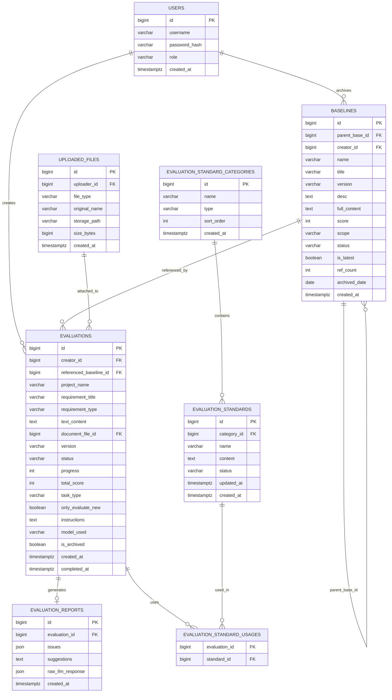

# 需求可测试性评估系统 — 数据库设计建议

> **数据库**: PostgreSQL 16+ (推荐) / MySQL 8.0+  
> **字符集**: UTF-8  
> **时间字段**: UTC 时区，`TIMESTAMPTZ` 类型

---

## ER 关系图



---

## 表结构详细说明

### `users` — 用户表

```sql
CREATE TABLE users (
    id              BIGSERIAL PRIMARY KEY,
    username        VARCHAR(64) NOT NULL UNIQUE,
    password_hash   VARCHAR(255) NOT NULL,
    role            VARCHAR(20) NOT NULL DEFAULT 'user' CHECK (role IN ('admin', 'user')),
    created_at      TIMESTAMPTZ NOT NULL DEFAULT NOW()
);
```

---

### `evaluation_standard_categories` — 评估标准分类表

```sql
CREATE TABLE evaluation_standard_categories (
    id          BIGSERIAL PRIMARY KEY,
    name        VARCHAR(128) NOT NULL,
    type        VARCHAR(20)  NOT NULL DEFAULT 'default' CHECK (type IN ('default', 'user')),
    sort_order  INT          NOT NULL DEFAULT 0,
    created_at  TIMESTAMPTZ  NOT NULL DEFAULT NOW()
);

-- 初始数据
INSERT INTO evaluation_standard_categories (name, type, sort_order) VALUES
    ('国际标准',   'default', 1),
    ('公司标准',   'default', 2),
    ('项目组标准', 'default', 3),
    ('自定义文档', 'user',    4);
```

---

### `evaluation_standards` — 评估标准文件表

```sql
CREATE TABLE evaluation_standards (
    id          BIGSERIAL PRIMARY KEY,
    category_id BIGINT       NOT NULL REFERENCES evaluation_standard_categories(id) ON DELETE CASCADE,
    name        VARCHAR(255) NOT NULL,
    content     TEXT,                              -- 文件解析后的文本内容（供 LLM 提示词使用）
    storage_path VARCHAR(512),                     -- 原始文件存储路径
    status      VARCHAR(20)  NOT NULL DEFAULT 'enabled' CHECK (status IN ('enabled', 'disabled')),
    updated_at  TIMESTAMPTZ  NOT NULL DEFAULT NOW(),
    created_at  TIMESTAMPTZ  NOT NULL DEFAULT NOW()
);

CREATE INDEX idx_standards_category ON evaluation_standards(category_id);
CREATE INDEX idx_standards_status ON evaluation_standards(status);
```

---

### `baselines` — 基准需求表

```sql
CREATE TABLE baselines (
    id              BIGSERIAL PRIMARY KEY,
    parent_base_id  BIGINT       REFERENCES baselines(id) ON DELETE SET NULL,  -- NULL 表示根版本
    creator_id      BIGINT       NOT NULL REFERENCES users(id),
    name            VARCHAR(255) NOT NULL,        -- 项目/基准名称（同 project_name）
    title           VARCHAR(512) NOT NULL,        -- 具体需求标题
    version         VARCHAR(20)  NOT NULL,        -- 如 "V1.0"
    desc            TEXT,
    full_content    TEXT,                         -- 需求全文
    score           INT          NOT NULL CHECK (score BETWEEN 0 AND 100),
    scope           VARCHAR(20)  NOT NULL DEFAULT 'private' CHECK (scope IN ('public', 'private')),
    status          VARCHAR(20)  NOT NULL DEFAULT 'enabled' CHECK (status IN ('enabled', 'disabled')),
    is_latest       BOOLEAN      NOT NULL DEFAULT TRUE,
    ref_count       INT          NOT NULL DEFAULT 0,
    archived_date   DATE         NOT NULL DEFAULT CURRENT_DATE,
    created_at      TIMESTAMPTZ  NOT NULL DEFAULT NOW()
);

CREATE INDEX idx_baselines_parent ON baselines(parent_base_id);
CREATE INDEX idx_baselines_creator ON baselines(creator_id);
CREATE INDEX idx_baselines_scope ON baselines(scope);
CREATE INDEX idx_baselines_name ON baselines(name);
```

**版本号规则（后端逻辑）**:
- 根基准（`parent_base_id IS NULL`）：版本从 `V1.0` 开始
- 子版本：在同父系所有版本中取最大版本号 +0.1，如 `V1.0` → `V1.1`

---

### `uploaded_files` — 上传文件表

```sql
CREATE TABLE uploaded_files (
    id              BIGSERIAL PRIMARY KEY,
    uploader_id     BIGINT       NOT NULL REFERENCES users(id),
    file_type       VARCHAR(20)  NOT NULL CHECK (file_type IN ('requirement', 'standard')),
    original_name   VARCHAR(512) NOT NULL,
    storage_path    VARCHAR(1024) NOT NULL,       -- 对象存储路径（如 S3 key）
    size_bytes      BIGINT       NOT NULL,
    created_at      TIMESTAMPTZ  NOT NULL DEFAULT NOW()
);
```

---

### `evaluations` — 评估任务记录表

```sql
CREATE TABLE evaluations (
    id                      BIGSERIAL PRIMARY KEY,
    creator_id              BIGINT       NOT NULL REFERENCES users(id),
    referenced_baseline_id  BIGINT       REFERENCES baselines(id) ON DELETE SET NULL,
    document_file_id        BIGINT       REFERENCES uploaded_files(id) ON DELETE SET NULL,
    project_name            VARCHAR(255) NOT NULL,
    requirement_title       VARCHAR(512) NOT NULL,
    requirement_type        VARCHAR(20)  NOT NULL CHECK (requirement_type IN ('text', 'document')),
    text_content            TEXT,
    version                 VARCHAR(20),          -- 在同项目中自动分配，如 "V1.2"
    status                  VARCHAR(20)  NOT NULL DEFAULT 'pending'
                                         CHECK (status IN ('pending', 'processing', 'completed', 'failed')),
    progress                INT          NOT NULL DEFAULT 0 CHECK (progress BETWEEN 0 AND 100),
    total_score             INT          CHECK (total_score BETWEEN 0 AND 100),
    task_type               VARCHAR(20)  NOT NULL CHECK (task_type IN ('full', 'incremental')),
    only_evaluate_new       BOOLEAN      NOT NULL DEFAULT FALSE,
    instructions            TEXT,
    model_used              VARCHAR(128),
    is_archived             BOOLEAN      NOT NULL DEFAULT FALSE,
    created_at              TIMESTAMPTZ  NOT NULL DEFAULT NOW(),
    completed_at            TIMESTAMPTZ
);

CREATE INDEX idx_evaluations_creator ON evaluations(creator_id);
CREATE INDEX idx_evaluations_project ON evaluations(project_name);
CREATE INDEX idx_evaluations_baseline ON evaluations(referenced_baseline_id);
CREATE INDEX idx_evaluations_status ON evaluations(status);
CREATE INDEX idx_evaluations_created ON evaluations(created_at DESC);
```

---

### `evaluation_reports` — 评估报告详情表

```sql
CREATE TABLE evaluation_reports (
    id              BIGSERIAL PRIMARY KEY,
    evaluation_id   BIGINT       NOT NULL UNIQUE REFERENCES evaluations(id) ON DELETE CASCADE,
    issues          JSONB        NOT NULL DEFAULT '[]',  -- 问题点列表（字符串数组）
    suggestions     TEXT         NOT NULL DEFAULT '',    -- 优化建议
    raw_llm_response JSONB,                              -- LLM 原始响应（调试用）
    created_at      TIMESTAMPTZ  NOT NULL DEFAULT NOW()
);

CREATE INDEX idx_reports_evaluation ON evaluation_reports(evaluation_id);
```

---

### `evaluation_standard_usages` — 评估与标准的关联表（多对多）

```sql
CREATE TABLE evaluation_standard_usages (
    evaluation_id   BIGINT NOT NULL REFERENCES evaluations(id) ON DELETE CASCADE,
    standard_id     BIGINT NOT NULL REFERENCES evaluation_standards(id) ON DELETE CASCADE,
    PRIMARY KEY (evaluation_id, standard_id)
);
```

---

## 关键业务逻辑建议

### 版本号管理

```python
def calculate_next_version(parent_base_id: Optional[int], project_name: str) -> str:
    if parent_base_id:
        # 在同父系中取最大版本号
        max_ver = query("SELECT MAX(version) FROM baselines WHERE parent_base_id = ?", parent_base_id)
        return f"V{float(max_ver.replace('V','')) + 0.1:.1f}"
    else:
        # 根版本始终 V1.0
        return "V1.0"
```

### 归档触发器（更新 is_latest）

```sql
-- 归档新版本时，将同父系的旧版本 is_latest 设为 FALSE
UPDATE baselines
SET is_latest = FALSE
WHERE (parent_base_id = :new_parent_base_id OR id = :new_parent_base_id)
  AND id != :new_baseline_id;
```

### 引用计数

```sql
-- 每次创建引用了 baseline 的评估任务时，计数 +1
UPDATE baselines SET ref_count = ref_count + 1 WHERE id = :referenced_baseline_id;
```

---

## 推荐索引策略

| 高频查询 | 推荐索引 |
|---|---|
| 按项目名查历史 | `evaluations(project_name, created_at DESC)` |
| 基准需求树查询 | `baselines(parent_base_id, is_latest)` |
| 按公开范围过滤 | `baselines(scope, status)` |
| 按用户查历史 | `evaluations(creator_id, created_at DESC)` |

---

## 数据库迁移顺序

1. `users`
2. `evaluation_standard_categories`
3. `evaluation_standards`
4. `uploaded_files`
5. `baselines`（自引用外键，需在表创建后 ALTER 或用 DEFERRABLE）
6. `evaluations`
7. `evaluation_reports`
8. `evaluation_standard_usages`
